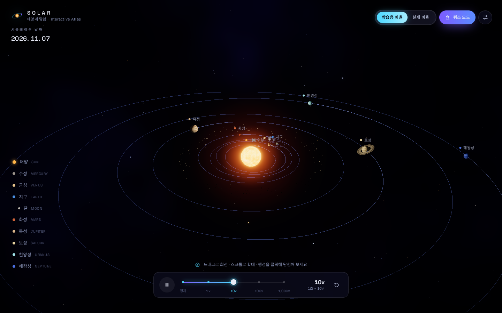
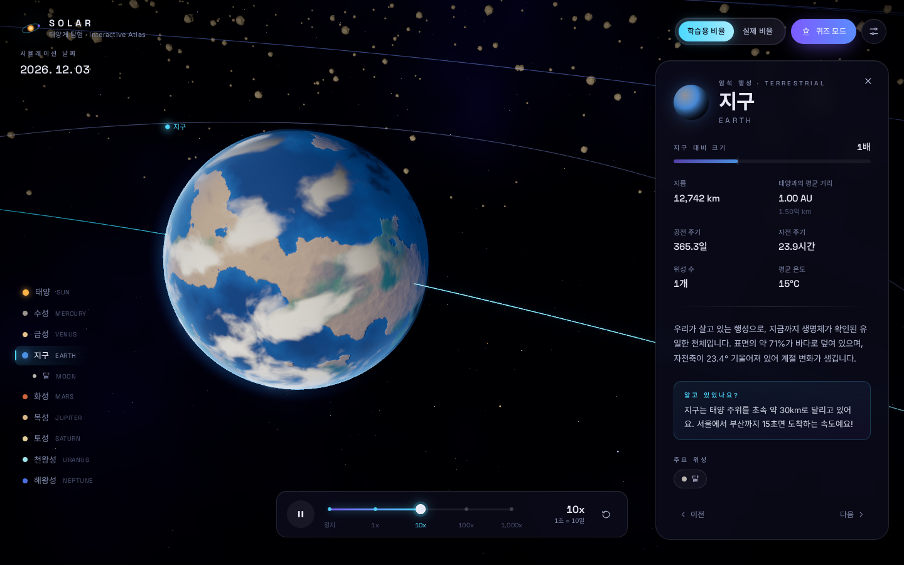
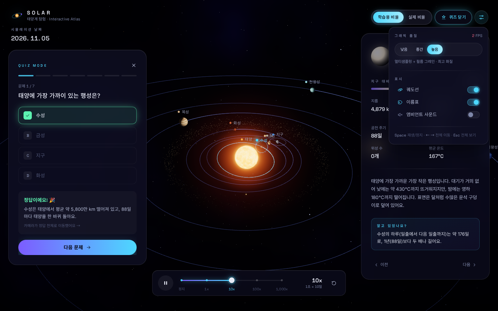
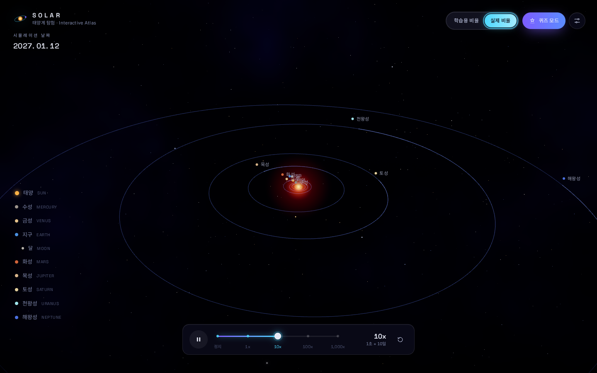
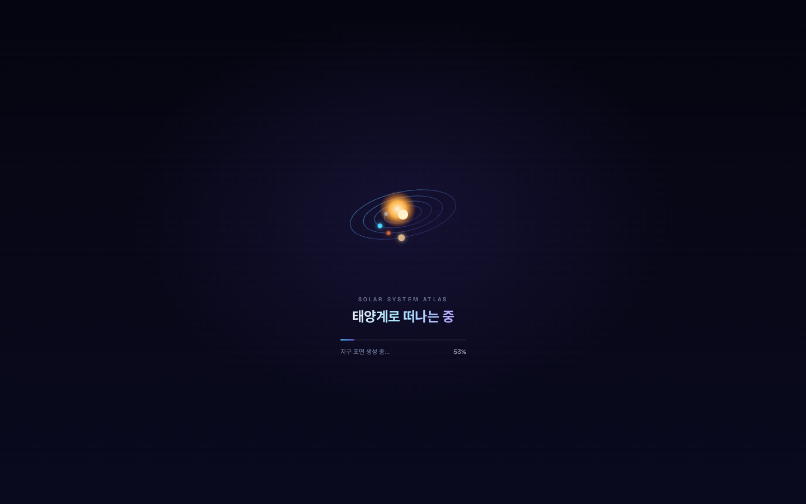

# SOLAR · 태양계 탐험 (Interactive Solar System Atlas)

React + TypeScript + Three.js(@react-three/fiber)로 만든 **3D 태양계 학습 웹앱**입니다.
실제 궤도 요소(케플러 궤도)로 움직이는 태양·8개 행성·달을 자유롭게 둘러보고, 클릭해 정보를 탐색하고, 퀴즈로 복습할 수 있습니다.
시작 시점의 행성 배치는 **오늘 날짜의 실제 위치**입니다.



| 행성 포커스 + 정보 패널 | 퀴즈 모드 + 설정 |
| --- | --- |
|  |  |
| **실제 비율 모드** | **커스텀 로더** |
|  |  |

---

## 설치 및 실행

```bash
npm install
npm run dev        # 개발 서버 (http://localhost:5173)
npm run build      # 타입 체크 + 프로덕션 빌드 (dist/)
npm run preview    # 빌드 결과 미리보기
npm test           # 단위/컴포넌트 테스트 (Vitest + RTL)
npm run coverage   # 커버리지 리포트 (utils/store/data 기준 80% 임계값)
```

Node 18 이상을 권장합니다. 외부 API·텍스처 CDN을 전혀 사용하지 않으므로 오프라인에서도 동작합니다.

### 학생용 학습 기능

- 우상단 **▶ 3D 탐사**: 태양부터 해왕성까지 8곳을 실제 3D 장면에서 순서대로 살펴봅니다. `자동 진행`을 누르면 약 11초마다 다음 천체로 카메라가 이동합니다. 직접 이전/다음으로 이동하거나 멈출 수 있으며, 매 단계의 질문에서 `답 확인`을 누른 뒤 마지막에 퀴즈로 복습합니다. 이 기능은 별도 MP4 파일이 아닌, 앱에서 실시간으로 렌더링하는 **조작 가능한 3D 애니메이션**입니다.
- **사진 아틀라스**: NASA 관측 자료 18장과 생성형 AI로 그린 학습 이미지 22장(새 이미지 20장 포함)을 탭으로 나누어 탐색합니다. 이미지를 눌러 크게 열고 `←` `→` 키나 화면 버튼으로 넘겨 보며, `Esc`로 닫습니다. 각 카드에 관찰 질문, 개념 설명과 NASA 학습 자료 링크를 넣었습니다. 생성 그림에는 항상 `생성형 AI로 그린 그림` 표시가 나오며 실제 관측 사진이 아님을 밝힙니다.
- 천체 정보의 **빛의 여행 시간**은 태양과 행성 사이 평균 거리(장반경)에 1 AU ≈ 8.317 광분을 곱한 학습용 근삿값입니다. 실제 시간은 공전 위치에 따라 달라집니다.
- **AI 천문 선생님**: 본인의 Gemini API 키를 입력하면 `gemini-3.5-flash-lite` 모델에 한국어로 질문합니다. 선택한 천체의 설명을 문맥으로 전달하며, 추천 질문·연속 대화·오류 안내·대화 지우기를 제공합니다.
- **행성 비교 실험실**: 서로 다른 두 행성을 고른 뒤 지름, 태양까지 평균 거리, 공전 주기 중 어느 쪽이 더 큰지 예측하고 막대와 수치로 확인합니다. 각 행성을 3D에서 바로 찾아갈 수 있습니다.

### Gemini API 키 안내

1. [Google AI Studio에서 Gemini API 키](https://aistudio.google.com/apikey)를 준비합니다. API 사용 가능 여부와 사용량은 본인 프로젝트 설정을 확인하세요.
2. 실행 중인 앱의 `✦ AI 선생님`을 눌러 키를 입력하고 천문 질문을 적습니다.
3. 기본값은 페이지 메모리에서만 사용하는 것입니다. `이 기기에 API 키 저장`을 직접 선택하면 이 브라우저의 localStorage에 저장해 다음 방문에도 사용할 수 있습니다. 선택을 해제하거나 `지우기`를 누르면 저장한 키를 삭제합니다. 앱은 키를 서버나 GitHub에 저장하지 않습니다.

질문은 사용자 브라우저에서 Google Gemini API로 직접 전송합니다. 저장을 선택한 키는 localStorage에 암호화되지 않은 상태로 보관되므로 공용 컴퓨터에서는 저장하지 마세요. 사용자가 입력한 키와 질문은 브라우저의 네트워크 요청 및 Google 서비스에서 처리됩니다. 공개 서비스에서 운영자가 공통 키를 제공하려면 별도의 서버 측 프록시와 인증이 필요합니다. AI 답변은 틀릴 수 있으므로 NASA 관측 자료와 비교하세요. 키가 없더라도 3D 탐사, 사진, 비교 실험실과 퀴즈는 사용할 수 있습니다.

관측 자료는 `public/images/nasa/`, 생성 일러스트는 `public/images/illustrations/`에 포함되어 인터넷 연결 없이도 표시됩니다. 관측 사진의 원본과 제공 기관은 `src/data/media.ts` 및 사진 카드의 `NASA 원본` 링크에서 확인할 수 있습니다. 새 일러스트의 주제, 주의 사항과 NASA의 근거 자료는 `src/data/generatedMedia.ts` 및 이미지 카드의 `NASA 학습 자료` 링크에 있습니다. 그림은 OpenAI ImageGen으로 만들었고, 특정 천체의 실제 지형·시점·색·크기·거리를 정확히 재현한 관측 자료가 아닙니다. 태양계 시뮬레이션의 거리·크기는 학습용 모드에서 과장되어 있으며, 사진은 시뮬레이션 날짜에 촬영된 영상이 아닙니다.

### 조작법

| 입력 | 동작 |
| --- | --- |
| 드래그 / 스크롤 / 우클릭 드래그 | 회전 / 확대·축소 / 이동 (감쇠 적용). 모바일은 한 손가락 회전, 핀치 줌 |
| 행성·이름표·좌측 목록 클릭 | 해당 천체로 카메라 이동 + 정보 패널 |
| `Space` | 재생 / 일시정지 |
| `←` `→` | 이전 / 다음 천체 |
| `Esc` | 선택 해제 (전체 조망으로 복귀) |

---

## 주요 기능

- **3D 태양계**: 태양(emissive + Bloom), 8개 행성, 달, 토성·천왕성 고리, 소행성대(인스턴싱), 수천 개의 별, 성운 스카이돔
- **케플러 궤도**: 이심률·궤도 경사·승교점·근일점을 반영한 타원 궤도. 실제 공전 주기 비율 유지, 달은 조석 고정
- **시간 컨트롤**: 정지 / 1x(1일/초) / 10x / 100x / 1000x(≈2.7년/초). 델타타임 기반이라 배속을 바꿔도 끊김 없음
- **비율 모드**: 학습용 비율 ↔ 실제 비율을 1.8초 동안 부드럽게 보간 (거리는 선형, 크기는 로그 공간 보간)
- **시네마틱 카메라**: `easeInOutCubic` 이징 + 호(arc) 궤적 비행, 도착 후 공전하는 행성을 자연스럽게 추적
- **정보 패널**: 지름, 거리, 공전·자전 주기, 위성 수, 평균 온도, 지구 대비 크기, 설명과 재미있는 사실
- **퀴즈 모드**: 9문제 풀에서 7문제를 무작위로 출제(보기 순서도 섞음). 답하면 카메라가 정답 천체로 날아가고, 정답은 컨페티와 글로우 펄스, 오답은 흔들림 효과
- **그래픽 품질 옵션**: 낮음/중간/높음 + 프레임 저하 시 자동 하향 조정
- **선택 기능**: 소행성대, 모바일 터치/반응형 레이아웃, Web Audio로 합성한 앰비언트 사운드

---

## 프로젝트 구조

```
src/
├─ components/
│  ├─ scene/            # 3D (Canvas 내부)
│  │  ├─ SolarScene.tsx       씬 루트 (품질 프로필 적용)
│  │  ├─ SimulationDriver.tsx 매 프레임 시뮬레이션 구동
│  │  ├─ Sun.tsx              emissive 태양 + 코로나 스프라이트 + 점광원
│  │  ├─ Planet.tsx           행성/위성 (텍스처, 노멀맵, 자전축, 구름)
│  │  ├─ PlanetRing.tsx       고리 (방사형 UV 재매핑)
│  │  ├─ Atmosphere.tsx       프레넬 대기 글로우 (림 + 헤일로)
│  │  ├─ OrbitRing.tsx        궤도선 (꼬리 그라데이션 셰이더)
│  │  ├─ StarField.tsx        별 (Points, 색온도, 반짝임)
│  │  ├─ Nebula.tsx           성운 스카이돔 (fBm 셰이더)
│  │  ├─ AsteroidBelt.tsx     소행성대 (InstancedMesh, 차등 회전)
│  │  ├─ SelectionIndicator.tsx / BodyLabel.tsx  선택 링, 이름표
│  │  ├─ CameraRig.tsx        OrbitControls + 포커스 훅
│  │  ├─ PostProcessing.tsx   Bloom → ToneMapping → Vignette (→ Noise)
│  │  └─ shaders.ts           GLSL 모음
│  └─ ui/               # 2D 오버레이
│     ├─ Loader, Header, PlanetNav, TopControls, SegmentedControl, SettingsPopover
│     ├─ TimeControl, SpeedSlider, InfoPanel, QuizModal, Confetti, Toast, InteractionHint
│     └─ Icons.tsx
├─ hooks/               # useOrbitAnimation, useCameraFocus, useTexturePreload, useSimDate,
│                       # useKeyboardShortcuts, useAmbientSound, useHoverCursor, useFps, useSphereGeometry
├─ data/                # planets.json, quiz.json, index.ts(런타임 검증 + 조회 함수)
├─ store/               # useAppStore.ts(Zustand, UI 상태) · runtime.ts(프레임 단위 가변 상태)
├─ styles/tokens.ts     # 디자인 토큰 (Tailwind와 3D 씬이 공유)
├─ utils/               # kepler, scale, easing, time, math, format, quality, quiz
│  └─ textures/         # noise, generators(절차적 텍스처), textureFactory(로딩/캐시/dispose), texture.worker
└─ types/               # CelestialBody, OrbitalElements, CameraTarget 등
```

### 설계 포인트

- **React 상태와 프레임 상태 분리**: 시뮬레이션 시각과 천체 위치는 `store/runtime.ts`의 일반 객체에 두고 `useFrame` 안에서만 읽습니다. 그래서 1000배속에서 정보 패널을 열어도 React 리렌더가 생기지 않습니다. 날짜 표시는 8Hz로 샘플링하고, 값이 바뀔 때만 갱신합니다.
- **프레임 실행 순서**: `useFrame` 우선순위를 명시해 떨림(jitter)을 막습니다.
  `-2` 시뮬레이션 → `-1` OrbitControls → `-1` 카메라 추적 → `-0.5` 이름표 위치 → `0` 천체·`<Html>` 투영 → `1` 후처리 렌더.
- **로그 깊이 버퍼**: 실제 비율 모드는 0.001부터 수천 단위까지 한 화면에 담아야 하므로 `logarithmicDepthBuffer`를 켜고, 커스텀 셰이더에는 `logdepthbuf` 청크를 넣었습니다.
- **리소스 해제**: 공유 구 지오메트리, 궤도선, 셰이더 머티리얼, 인스턴스 지오메트리는 언마운트될 때 `dispose()`하고, 텍스처 캐시는 씬이 언마운트될 때 GPU 메모리를 해제합니다.

---

## 텍스처 교체 방법

기본값은 **외부 파일 없이 런타임에 생성하는 절차적 텍스처**입니다. 색상 맵과 노멀맵을 3D 노이즈로 만들기 때문에 경도 경계선(seam)이 없고, Web Worker 풀에서 병렬로 생성해 로더 애니메이션이 끊기지 않습니다.

실제 이미지 텍스처를 쓰려면 다음 순서로 합니다.

1. 등장방형(equirectangular, 가로:세로 = 2:1) 이미지를 `public/textures/`에 둡니다.
2. `src/data/planets.json`에서 해당 천체의 `texture.map`(필요하면 `texture.normalMap`) 경로를 지정합니다.

```jsonc
"texture": {
  "style": "earth",                       // 절차적 fallback 스타일
  "palette": ["#0b2a5b", "..."],          // 절차적 fallback 색상
  "seed": 42,
  "map": "textures/earth_daymap.jpg",     // ← public/ 기준 상대 경로
  "normalMap": "textures/earth_normal.jpg"
}
```

**에러 처리 순서**는 다음과 같습니다. 모든 단계에서 콘솔에 경고를 남깁니다.

1. 이미지를 불러옵니다(10초 타임아웃).
2. 실패하면 절차적 텍스처를 생성합니다(워커 → 메인 스레드 순으로 시도).
3. 그것도 실패하면 `color` 필드 색의 단색 구체로 표시합니다.

`planets.json`은 로드할 때 런타임 검증(`src/data/index.ts`)을 거치므로, 필드를 빠뜨리거나 값이 잘못되면 어느 천체의 어느 필드가 문제인지 알려 줍니다.

---

## 디자인 토큰 커스터마이징

색상, 폰트, 모션 값은 `src/styles/tokens.ts` 한 곳에서 정의합니다.

- `tailwind.config.ts`가 이 파일을 import해 `theme.extend`에 넣습니다. 예: `bg-space-900`, `text-accent-cyan`, `text-ink-muted`.
- 3D 씬(성운 셰이더 색, 선택 링, 궤도 강조색)도 같은 토큰을 씁니다.
- 글래스모피즘 클래스(`.glass`, `.glass-strong`)와 CSS 변수는 `src/index.css`에 있습니다.

| 토큰 | 값 | 용도 |
| --- | --- | --- |
| `space.900 → space.800` | `#050510 → #0a0a1f` | 딥 스페이스 배경 그라데이션 (순수 검정 미사용) |
| `accent.cyan` / `accent.violet` | `#4dd8ff` / `#7c5cff` | 궤도 강조, 선택, 버튼, 슬라이더 |
| `ink.primary` | `#e6e9f5` | 본문 텍스트 (순수 흰색 미사용) |
| `glass.bg` / `glass.border` | `rgba(15,15,35,.6)` / `rgba(255,255,255,.1)` | 글래스 패널 + `blur(20px)` |
| `motion.fast/base/slow` | 150 / 220 / 300ms | 모든 UI 전환 시간 |
| `sceneTokens.orbit*Opacity` | 0.22 / 0.4 / 0.85 | 궤도선 기본 / 호버 / 선택 |

폰트는 제목·수치에 **Space Grotesk**, 본문에 **Inter**, 한글에 **Noto Sans KR**을 씁니다. 모두 `@fontsource`로 로컬 번들링하고, 수치에는 `tabular-nums`(`.num` 클래스)를 적용합니다.

---

## 성능 옵션

우상단 ⚙ 설정에서 품질을 바꿀 수 있고, 실시간 FPS도 표시됩니다. 처음에는 기기 사양(코어 수, 메모리, 터치 기기 여부)으로 품질을 추정하며, URL `?quality=low|medium|high`로 강제할 수 있습니다.

| 항목 | 낮음 | 중간 | 높음 |
| --- | --- | --- | --- |
| 후처리 (Bloom, 톤매핑, 비네트) | **끔** | 켬 | 켬 + 필름 그레인 |
| 멀티샘플링 (composer) | – | 0 | 4x |
| 픽셀 비율(DPR) | 1 | 최대 1.5 | 최대 2 |
| 별 / 소행성 수 | 2,500 / 700 | 6,000 / 1,800 | 10,000 / 3,500 |
| 구 세그먼트 / 궤도 샘플 | 48 / 180 | 64 / 360 | 96 / 512 |
| 텍스처 해상도 | 512×256 | 1024×512 | 1024×512 |
| 성운 노이즈 옥타브 | 2 | 4 | 5 |

- **자동 품질 조절**: drei `PerformanceMonitor`가 프레임 저하를 감지하면 품질을 한 단계 낮추고 토스트로 알려 줍니다. 사용자가 직접 품질을 고르거나 URL로 지정하면 자동 조절을 멈춥니다.
- **드로우콜 최소화**: 별은 Points 1개, 소행성은 InstancedMesh 1개로 그리고, 모든 천체가 구 지오메트리 하나를 공유합니다.
- **변경이 있을 때만 계산**: 궤도선 정점은 비율이 전환되는 동안에만 다시 계산하고, 소행성 행렬은 시간이나 비율이 바뀔 때만 갱신합니다.
- **고배속 안정성**: 프레임 delta를 최대 0.1초로 제한해 탭 전환 후 순간이동하는 현상을 막습니다. 자전 애니메이션은 시각적 최대 속도를 두어 고배속에서 스트로보 현상이 생기지 않게 합니다.

---

## 테스트

```bash
npm test
npm run coverage
```

- `utils/kepler.test.ts`: 케플러 방정식 해(이심률 0~0.97), 주기성, 근일점·원일점 거리, 좌표 변환의 길이 보존
- `utils/scale.test.ts`: 학습용·실제 거리, 로그 공간 반지름 보간의 단조성과 양 끝값, 위성 거리, 비율 진행도
- `utils/time.test.ts`: 델타타임 누적, 프레임레이트 독립성, 배속 변경 시 연속성, delta 클램프, 자전 속도 상한
- `utils/easing`, `format`, `quiz`, `quality`, `textures/generators`(노이즈, seam 없음, 노멀맵, 고리 간극), `data`(스키마 검증), `store`
- 컴포넌트: `InfoPanel`, `TimeControl`(ARIA slider, 키보드, 드래그), `QuizModal`(정답·오답·결과·재도전), `TopControls`, `Loader`

순수 로직(`utils/`, `store/`, `data/`) 커버리지는 라인·함수 100%, 분기 98% 이상입니다. `vite.config.ts`에 80% 커버리지 임계값을 지정해 두어, 기준에 못 미치면 `npm run coverage`가 실패합니다.

---

## 데이터 출처 및 단순화

- 궤도 요소: NASA JPL "Approximate Positions of the Planets"(J2000 평균 궤도 요소) 기반 값
- 위성 수는 2025년 발표 기준이며, 새 발견에 따라 늘어날 수 있습니다.
- N체 섭동과 세차 운동은 생략했습니다. 학습용으로는 충분히 정확하지만 천문 관측용 정밀 궤도력은 아닙니다.
